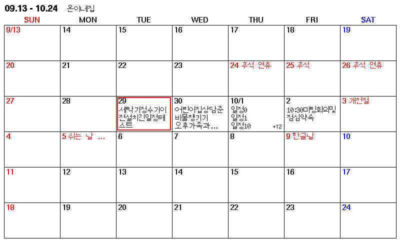

# CalendarDisplay_E1002 · v1.0.0

Seeed Studio reTerminal E1002용 냉장고 달력. **제품 도착 → 설정 → USB-C → Upload**를 위한 준비 버전입니다. 펌웨어 빌드·파서·픽셀 배치는 PC에서 검증했으며, 실제 기기 동작/전류는 아직 검증하지 않았습니다.



## 바로 업로드

1. Windows에 **Python 3**, **VS Code + PlatformIO IDE**를 설치합니다. Python 설치 시 PATH 옵션을 선택합니다.
2. 이 저장소를 내려받아 VS Code에서 프로젝트 폴더를 엽니다.
3. `setup.bat`를 실행합니다. 집 **2.4GHz Wi-Fi**, iCloud **공개 캘린더** 주소, 상단 제목을 입력합니다. 최대 4개 캘린더를 설정할 수 있습니다.
4. E1002 전원을 켜고 **데이터 전송 가능한 USB-C 케이블**로 연결합니다.
5. VS Code 아래 PlatformIO **Upload**를 누릅니다. 처음에는 라이브러리 다운로드로 시간이 걸립니다.
6. 첫 동기화와 전체 화면 갱신을 기다립니다. 화면이 여러 번 깜박이는 것은 전체 refresh 과정일 수 있습니다. 공식 예시는 refresh 자체 약 25–30초를 안내하며 네트워크 시간이 추가됩니다.
7. 다음 갱신은 sleep 진입 약 24시간 후입니다. 바로 반영하려면 **오른쪽 녹색 KEY0**를 짧게 누르고 뗍니다.

PlatformIO 터미널 명령은 다음과 같습니다.

```sh
python tools/setup_config.py
pio run
pio run -t upload
pio device monitor -b 115200
```

`pio`를 찾지 못하면 VS Code의 **PlatformIO 터미널**에서 실행하거나 `python -m platformio`로 대체합니다. 다른 COM 포트를 잡으면 `pio run -t upload --upload-port COM5`처럼 실제 포트를 지정합니다.

Deep Sleep 후 USB CDC 포트가 사라지는 것은 가능하며 업로드 실패로 단정하지 않습니다. 업로드가 연결을 못 잡으면 BOOT를 누른 채 RESET을 짧게 누른 뒤 BOOT를 놓아 다운로드 모드로 진입하고, 새 COM 포트를 선택해 다시 Upload합니다. 기판의 BOOT/RESET 표기를 확인하세요. KEY0는 BOOT와 다릅니다.

## 화면과 동작

- 현재 주 기준 **이전 2주 + 현재 주 + 이후 3주**, SUN–SAT 42일.
- 제목 `09.13 - 10.24   온이네집`, 한글 본문 Unifont 16px.
- 일요일 빨강 / 토요일 파랑 / 공휴일 날짜와 이름 빨강 / 오늘 빨간 테두리.
- 공휴일은 날짜 옆에 표시하며 일반 일정 개수를 차지하지 않습니다.
- 일정 앞 색상 점 없음. 공백·탭·줄바꿈·NBSP·전각 공백 제거.
- 1개 일정 최대 3줄. 2개 일정 각각 최대 2줄, **전체 합계 3줄**을 2+1 또는 1+2로 배분. 3개는 각각 1줄. 4개 이상은 3개와 오른쪽 `+N`.
- 71px 셀에서 한글을 줄이지 않고 날짜+본문 4줄을 모두 표시할 수 없으므로 2개 일정의 총 4줄은 제공하지 않습니다.
- 내용/오늘/기간/제목이 같으면 자동 refresh와 패널 초기화를 생략합니다. KEY0는 정상 다운로드 시 강제 refresh합니다.
- 자정에 깨우는 구조는 아닙니다. 오늘 테두리는 다음 동기화 때 이동하며 수동 동기화는 이후 24시간 주기를 다시 시작합니다.

## 미리보기

- `preview.html`: 설정·인터넷 없이 열리는 **고정 예시**.
- `preview.bat`: 실제 config.h의 공개 캘린더를 읽어 `127.0.0.1:8765`에서 표시. 새로고침 시 다시 조회.
- 브라우저도 동일한 U8g2 비트맵과 `src/ui_layout.h` 배치를 사용합니다. 800×480 예시의 펌웨어/Canvas 전체 픽셀 일치 회귀 테스트가 있습니다.
- 실제 패널의 색, 반사도, 잔상과 refresh 동작은 PC 프리뷰로 검증할 수 없습니다.
- PC 프리뷰는 별도 Python 파서이며 기기의 NVS 공휴일 캐시/전체 실패 시 화면 유지 정책을 시뮬레이션하지 않습니다. 파서의 주요 규칙은 테스트로 비교합니다.

## 오류 시 동작

| 상황 | 동작 |
|---|---|
| 설정 누락 | 최초에는 설정 안내, 기존 달력이 있으면 화면 유지 |
| Wi-Fi 실패 | 최초에는 실패 안내, 이후 기존 달력 유지 |
| NTP 실패 | Deep Sleep에서 유지된 유효 RTC가 있으면 사용, 없으면 화면 유지/최초 실패 안내 |
| 개인 캘린더 일부 실패·잘린 ICS·지원 밖 규칙·용량 초과 | 개인 일정 일부만 표시하지 않고 기존 정상 화면 유지 |
| 공휴일 소스 실패 | NVS의 마지막 공휴일 중 현재 기간과 겹치는 항목을 재사용하고 개인 일정은 갱신 |
| 공휴일 캐시 없음/현재 기간 밖 | 개인 일정 표시, 공휴일은 없을 수 있음. 우측 위 작은 빨간 점으로 공휴일 소스 실패 표시 |
| 정상 빈 캘린더 | 빈 일정도 정상으로 처리; 삭제한 일정이 화면에서 제거됨 |
| 화면 갱신 후 BUSY가 계속 LOW | 새 화면 해시를 저장하지 않아 다음 동기화에서 다시 시도 |
| KEY0를 계속 누른 채 sleep 진입 | 재부팅 반복을 막기 위해 해당 sleep은 timer만 사용. 버튼을 놓고 RESET하거나 timer까지 대기 |

오류 후에는 KEY0 또는 다음 24시간 timer로 재시도합니다. 기존 화면 유지 중에는 오늘 표시도 이전 날짜일 수 있습니다. 로그에는 URL·비밀번호·일정 제목을 출력하지 않습니다.

## 설정과 보안

`src/config.example.h` → `src/config.h` 수동 복사도 가능합니다. `src/config.h`는 계속 gitignore 대상입니다. 공개 URL과 비밀번호가 포함된 config.h, 로컬 ICS, 실제 설정으로 빌드한 firmware.bin은 공유하거나 커밋하지 마세요. CI는 예시 설정만 사용합니다.

HTTPS는 지정 CA로 서버 인증서를 검증하며 `setInsecure()`를 사용하지 않습니다. iCloud/공휴일의 CA 체인이 바뀌면 안전하게 실패할 수 있으므로 `src/tls_roots.h` 갱신이 필요합니다. 공개 URL은 링크를 아는 사람이 읽을 수 있는 공개 공유 방식입니다. 비공개 CalDAV 로그인은 지원하지 않습니다.

공휴일은 Google의 한국 **official holiday ICS**를 자동 사용합니다. 정부의 직접 제공 API는 아닙니다. 별도 키/설정은 필요 없고 소스 변경 시 선택적으로 `HOLIDAY_ICS_URL`을 설정할 수 있습니다. 임시공휴일/대체공휴일 반영 시점은 소스에 의존합니다.

## 지원 범위 및 도착 후 점검

[검증 결과·폰트/메모리·반복 일정 지원 범위·알려진 제한](docs/RELEASE_READINESS.md)

[제품 도착 후 테스트 순서·전류 측정 체크리스트](docs/HARDWARE_CHECKLIST.md)

[폰트/CA 등 제3자 자료 출처](docs/THIRD_PARTY.md)

## 개발 검증

```sh
pio run
python -m unittest discover -s tests -v
python -m py_compile tools/*.py
```

회귀 테스트는 PC의 g++, gcc, Node.js가 필요합니다(일반 사용자 Upload와 preview.bat에는 불필요). 실제 C++ ICS 파서를 ASan/UBSan으로 실행하고, 실제 펌웨어 UI/U8g2 렌더링을 Canvas와 비교합니다. ptrace 기반 컨테이너에서 LeakSanitizer가 `/proc/.../task` 접근 오류를 낼 경우에만 `ASAN_OPTIONS=detect_leaks=0`으로 실행합니다. 이 환경에서 메모리 누수 검사는 하지 못했으며 주소/정의되지 않은 동작 검사는 유지했습니다.

`src/main.cpp`의 기존 core → ICS → UI → app 구조를 유지했습니다. 날짜 파서·네트워크·레이아웃 상수만 별도 파일로 분리했습니다.
